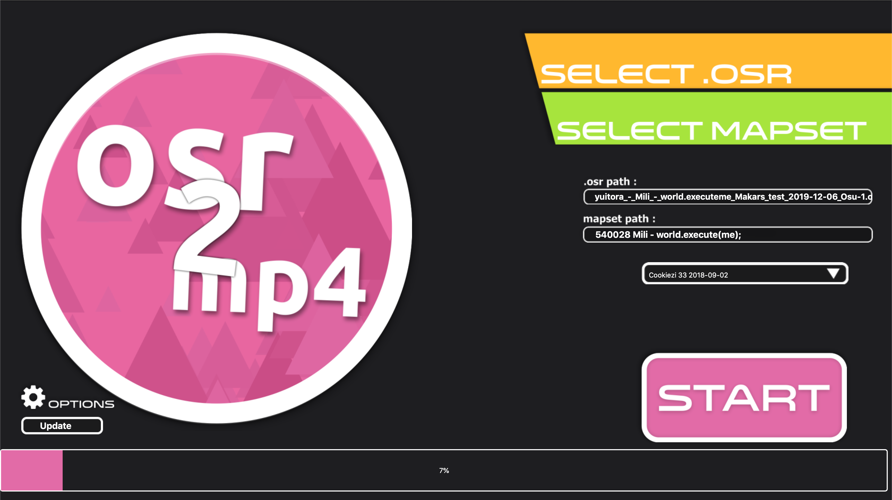
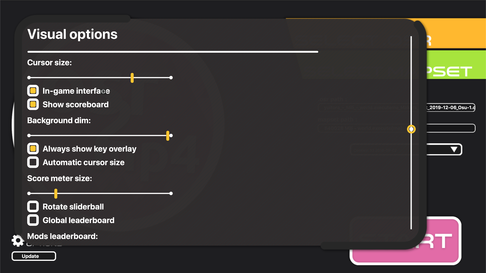
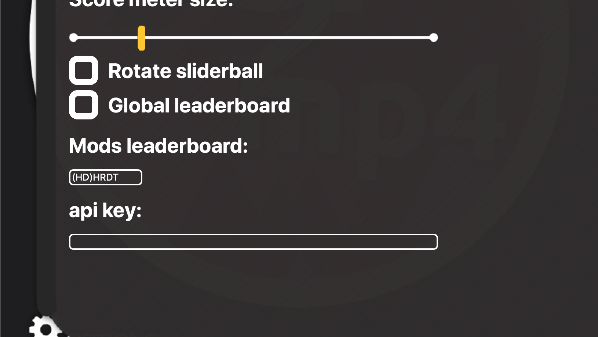

# osr2mp4-app
 An application to convert replay files to video.
 
 
 Settings page:
 
 
### Additional notes
+ Automatically search for the latest replay file in the Replays folder. So you just need to press F2 to export the replay then alt tab to the app.
+ Automatically search for the beatmap. So most of the time you just need to select the replay file.
+ To enable global leaderboard, you need to enter the api key in the settings. To get the api key: https://osu.ppy.sh/p/api/
+ If you want to include all mods plays in the leaderboard, put * in the Mods leaderboard textbox. If you want to include only Hidden play. If you want to include HDHR and HR, put (HD)HR, HR will be a required mod and HD is an optional mod.
